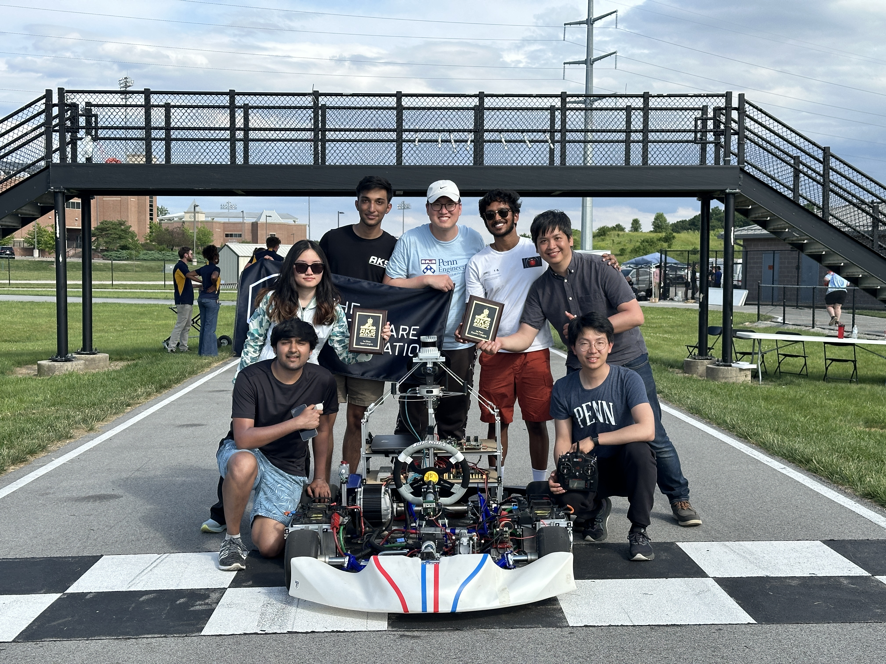

In collaboration with UPenn ESE Professor Rahul Mangharam, his lab xLab, and the global Autoware Foundation, my team and I designed, built, and actuated an autonomous electric GoKart. Starting with the standard manually-driven design from TopKart, we then took everything apart and strapped it up with autonomy features, including sensors, drivers, motors, microcontrollers, and much more. After rigorous unit testing  and autonomy testing, we rented a minivan, and packaged the entire product on an 11 hour journey to Purdue University in Indiana, where we competed in the 2024 AKS Grad Prix against 5 other universities.

We raced in two challenges, including: (1) the Open Challenge where we fused vision, IMU data and GNSS localization using the FixPosition Vision-RTK2 sensor to guide pure pursuit path following of pre-determined waypoints,  and (2) the Reactive Challenge where we fused live sensory data from a camera and Ouster LiDAR to identify and follow-the-gap between orange cone-marked lanes and avoid obstacles. We won both challenges, with a record-breaking time of 5:48 (~1:09 per lap) to complete five laps, each of approximately 400 meter and 5 turns.

A central engineering priority throughout this project has been reproducibility. As such, we’ve made sure to document everything in GitHub, from successes to failures, from CAD files to PCB designs, from lower-level embedded to higher-level planning controls code, from one iteration to the next, from engineering decisions to empirical evidence. We build this GoKart not just to play around with, but to provide a research platform for various academic and corporate organizations with software that requires testing. Whereas small handheld (~1/10 scale) toy cars are cheap and affordable, and full-sized cars are ultimately most practical, our GoKart achieves the best of both worlds.

