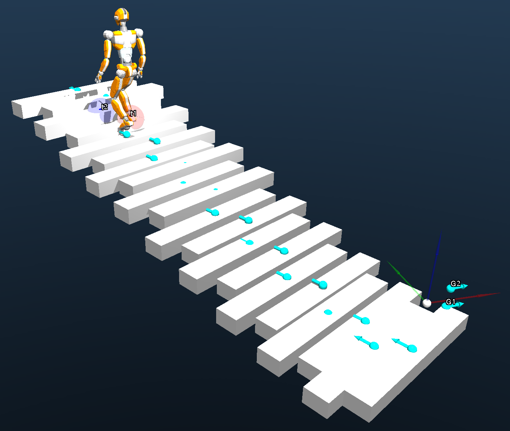

In this project, we aim to create humanoid robot movements
in a 3D space that includes both flat areas and stairs of varying
heights. To do this effectively, we need to carefully plan
both the steps the robot will take and its overall body move-
ment. We’ve decided to handle these two aspects—footstep
sequencing and full-body motion—separately. This separation
allows for more precise control over the movement’s quality.
The effectiveness of the footstep plan can be measured using
various criteria, like the number of steps or other performance
metrics. The quality of the movement, on the other hand, is
primarily judged by its ability to meet all necessary constraints
to prevent falls and maintain stability. Separating the planning
and control processes also simplifies fine-tuning, as it narrows
down the range of influence for each parameter.
We propose a hierarchical control scheme with dynamic
and static step planners and a Reinforcement Learning (RL)
based controller. In this report we will present the planning
and control methods used in our system, a comparison of
the different path planning algorithms we used, our bipedal
robot JVRC-1 achieving respectable performance traversing
both flat surfaces and stairs in MuJoCo simulation, as well as
unsuccessful attempts and future work.

